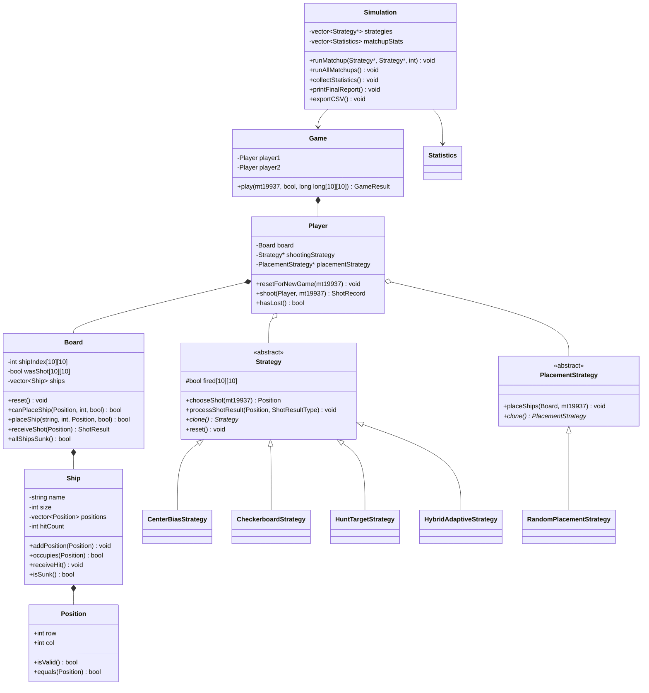

# Mini Project C++ OOP: BattleShip Strategy Benchmark

## 1. Giới Thiệu Project

Đây là mini project C++ console mô phỏng trò chơi BattleShip để phân tích chiến thuật bắn tàu và chiến thuật đặt tàu bằng lập trình hướng đối tượng OOP.

Project tập trung trả lời 2 câu hỏi chính:

1. Nếu là người bắn tàu, chiến thuật nào tối ưu nhất?
2. Nếu là người đặt tàu, nên đặt tàu như thế nào để đối thủ khó bắn trúng?

Project được thiết kế theo hướng học thuật, phù hợp với sinh viên năm nhất hoặc năm hai. Code ưu tiên rõ ràng, dễ đọc, có comment tiếng Việt và chỉ dùng các kiến thức OOP cơ bản đến trung bình như class, object, encapsulation, inheritance, polymorphism, abstract class, virtual function, vector, struct, enum và mảng 2 chiều.

## 2. Các File Trong Project

Thư mục project gồm các file chính:

```text
MiniProject_BattleShip_ver2/
|-- BattleshipOOP_OneFile.cpp
|-- README.md
|-- battleship_results.csv
```

Trong đó:

- `BattleshipOOP_OneFile.cpp`: file code C++ hoàn chỉnh, toàn bộ project nằm trong một file duy nhất.
- `README.md`: tài liệu mô tả ý tưởng, thiết kế OOP, chiến thuật và kết luận.
- `battleship_results.csv`: file kết quả thống kê được xuất ra sau simulation.

## 3. Luật Game BattleShip

- Bàn chơi có kích thước 10x10.
- Mỗi người chơi có 5 tàu:
  - Destroyer: 2 ô
  - Submarine: 3 ô
  - Cruiser: 3 ô
  - Battleship: 4 ô
  - Carrier: 5 ô
- Tàu được đặt ngẫu nhiên vào các vị trí hợp lệ.
- Tàu có thể nằm ngang hoặc dọc.
- Tàu không được chồng lên nhau.
- Mỗi lượt bắn vào một tọa độ.
- Nếu bắn trúng tàu thì kết quả là HIT.
- Nếu bắn trượt thì kết quả là MISS.
- Nếu toàn bộ ô của một tàu bị bắn trúng thì kết quả là SUNK.
- Bot thắng khi bắn chìm toàn bộ 5 tàu của đối thủ.
- Chương trình có xử lý tránh bắn trùng một ô.
- Chương trình có xử lý random hợp lệ khi đặt tàu và khi bắn.

## 4. Mục Tiêu Mô Phỏng

Project chạy mô phỏng tự động nhiều trận giữa các bot để thu thập số liệu thống kê. Mục tiêu không phải là hiển thị từng lượt chơi, mà là dùng dữ liệu để so sánh hiệu quả chiến thuật.

Các số liệu được thu thập gồm:

- Tổng số trận.
- Số trận thắng của từng bot.
- Tỉ lệ thắng.
- Tổng số phát bắn.
- Số HIT.
- Số MISS.
- Độ chính xác.
- Số lượt bắn trung bình để thắng.
- Ma trận HIT 10x10.

## 5. Các Chiến Thuật Bắn

### 5.1 Center Bias Strategy

Bot ưu tiên bắn các ô gần trung tâm bàn cờ trước. Các ô trung tâm được bắn theo thứ tự gần tâm nhất. Khi vùng trung tâm đã bị bắn hết, bot chuyển sang bắn random các ô còn lại.

Ưu điểm:

- Ý tưởng đơn giản, dễ hiểu.
- Hợp lý nếu giả định tàu có khả năng xuất hiện nhiều ở vùng trung tâm.

Nhược điểm:

- Không có Target mode.
- Sau khi bắn HIT, bot không biết truy đuổi để đánh chìm tàu nhanh.

### 5.2 Checkerboard Strategy

Bot ưu tiên bắn theo mẫu caro. Các ô được ưu tiên là những ô thỏa điều kiện:

```cpp
(row + col) % 2 == 0
```

Khi các ô caro đã bị bắn hết, bot chuyển sang bắn random các ô còn lại.

Ưu điểm:

- Giảm số ô cần dò trong giai đoạn đầu.
- Phù hợp với BattleShip vì tàu nhỏ nhất có kích thước 2, nên bắn theo caro vẫn có khả năng chạm tàu.

Nhược điểm:

- Không có Target mode.
- Sau khi bắn HIT, bot vẫn không truy đuổi tàu.

### 5.3 Hunt & Target Strategy

Chiến thuật này có 2 trạng thái:

- Hunt mode: bot bắn random có kiểm soát để tìm tàu.
- Target mode: khi bắn HIT, bot ưu tiên bắn các ô xung quanh vị trí HIT.

Nếu tiếp tục HIT, bot cố gắng xác định hướng của tàu rồi bắn tiếp theo hướng đó. Nếu hướng hiện tại không hợp lệ hoặc bắn MISS, bot thử hướng ngược lại hoặc quay về Hunt mode khi không còn mục tiêu hợp lệ.

Ưu điểm:

- Sau khi tìm thấy tàu, bot có khả năng đánh chìm nhanh hơn.
- Mạnh hơn các chiến thuật chỉ bắn theo mẫu đơn giản.

Nhược điểm:

- Trong Hunt mode, bot vẫn dùng random nên chưa tối ưu hoàn toàn vùng tìm kiếm.

### 5.4 Hybrid Adaptive Strategy

Đây là chiến thuật kết hợp:

- Center Bias
- Checkerboard
- Hunt & Target

Trong Hunt mode, bot ưu tiên các ô caro ở gần trung tâm. Khi bắn HIT, bot chuyển sang Target mode giống Hunt & Target để truy đuổi và đánh chìm tàu.

Ưu điểm:

- Tìm tàu hiệu quả hơn nhờ checkerboard.
- Ưu tiên trung tâm để tăng khả năng phát hiện tàu sớm.
- Có Target mode để đánh chìm tàu nhanh sau khi HIT.

Nhược điểm:

- Code phức tạp hơn các chiến thuật còn lại.
- Cần lưu trạng thái nhiều hơn.

## 6. Chiến Thuật Đặt Tàu

Project hiện tại cài đặt chiến thuật:

### Random Placement Strategy

Tàu được đặt ngẫu nhiên vào vị trí hợp lệ, không chồng lên nhau. Mỗi tàu có thể nằm ngang hoặc dọc.

Chiến thuật này giúp tạo dữ liệu mô phỏng khách quan, vì vị trí tàu thay đổi liên tục qua từng trận.

Dựa trên ma trận HIT, người chơi có thể rút ra gợi ý đặt tàu:

- Tránh đặt quá nhiều tàu ở vùng trung tâm nếu đối thủ dùng Center Bias hoặc Hybrid Adaptive.
- Ưu tiên rải tàu về biên và góc nếu ma trận HIT cho thấy các vùng này ít bị bắn trúng hơn.
- Không đặt các tàu quá sát nhau để tránh bị đối thủ truy đuổi liên tục sau khi HIT.
- Thay đổi hướng ngang/dọc để giảm khả năng bị đoán hướng.

## 7. Thiết Kế OOP

### 7.1 Position

Lưu tọa độ trên bàn cờ gồm `row` và `col`.

Nhiệm vụ chính:

- Kiểm tra tọa độ có hợp lệ không.
- So sánh hai vị trí có giống nhau không.

### 7.2 Ship

Quản lý thông tin của một tàu.

Thuộc tính chính:

- Tên tàu.
- Kích thước tàu.
- Danh sách vị trí tàu chiếm.
- Số lần bị bắn trúng.

Nhiệm vụ chính:

- Kiểm tra tàu có chiếm một vị trí hay không.
- Nhận HIT.
- Kiểm tra tàu đã chìm chưa.

### 7.3 Board

Quản lý bàn chơi 10x10.

Nhiệm vụ chính:

- Reset bàn chơi.
- Kiểm tra vị trí đặt tàu hợp lệ.
- Đặt tàu.
- Nhận phát bắn từ đối thủ.
- Trả về kết quả MISS, HIT hoặc SUNK.
- Kiểm tra tất cả tàu đã chìm chưa.

### 7.4 Strategy

`Strategy` là lớp cha trừu tượng cho các chiến thuật bắn.

Các chiến thuật cụ thể kế thừa từ `Strategy` và override các hàm ảo như:

```cpp
virtual Position chooseShot(mt19937& rng) = 0;
virtual void processShotResult(Position p, ShotResultType result) = 0;
virtual Strategy* clone() const = 0;
```

### 7.5 PlacementStrategy

`PlacementStrategy` là lớp cha trừu tượng cho các chiến thuật đặt tàu.

Hàm quan trọng:

```cpp
virtual void placeShips(Board& board, mt19937& rng) = 0;
```

Nhờ lớp này, project có thể mở rộng thêm nhiều cách đặt tàu khác mà không cần sửa logic của `Player` hoặc `Game`.

### 7.6 Player

Mỗi `Player` có:

- Một `Board` riêng.
- Một con trỏ `Strategy*` để bắn.
- Một con trỏ `PlacementStrategy*` để đặt tàu.

`Player` không cần biết chiến thuật cụ thể là gì. Player chỉ gọi hàm ảo thông qua con trỏ lớp cha.

### 7.7 Game

`Game` mô phỏng một trận đấu giữa 2 player.

Nhiệm vụ chính:

- Reset game mới.
- Cho hai bot lần lượt bắn.
- Ghi nhận HIT, MISS, SUNK.
- Xác định bot thắng.
- Trả về kết quả trận đấu.

### 7.8 Simulation

`Simulation` chạy toàn bộ benchmark.

Nhiệm vụ chính:

- Tạo danh sách 4 chiến thuật bắn.
- Chạy toàn bộ 16 matchup.
- Gom thống kê từng matchup.
- Xếp hạng chiến thuật.
- In báo cáo cuối.
- Xuất file CSV.

### 7.9 Statistics

`Statistics` lưu số liệu thống kê.

Các thông tin chính:

- Số trận.
- Số trận thắng.
- Tổng số phát bắn.
- Tổng HIT.
- Tổng MISS.
- Accuracy.
- Average shots/game.
- Average turns to win.
- Hit matrix 10x10.

## 8. Class Diagram



## 9. OOP Trong Project

### 9.1 Tính Đóng Gói

Tính đóng gói thể hiện ở các class như `Ship`, `Board`, `Player`.

Ví dụ:

- `Ship` che giấu `name`, `size`, `positions`, `hitCount`.
- `Board` che giấu mảng `shipIndex`, `wasShot` và danh sách `ships`.
- `Player` che giấu board và chiến thuật bên trong.

Bên ngoài chỉ có thể thao tác thông qua các hàm public.

### 9.2 Tính Kế Thừa

Tính kế thừa thể hiện ở:

- `CenterBiasStrategy` kế thừa `Strategy`.
- `CheckerboardStrategy` kế thừa `Strategy`.
- `HuntTargetStrategy` kế thừa `Strategy`.
- `HybridAdaptiveStrategy` kế thừa `Strategy`.
- `RandomPlacementStrategy` kế thừa `PlacementStrategy`.

### 9.3 Tính Đa Hình

Tính đa hình thể hiện qua việc `Player` giữ con trỏ lớp cha:

```cpp
Strategy* shootingStrategy;
PlacementStrategy* placementStrategy;
```

Khi gọi:

```cpp
shootingStrategy->chooseShot(rng);
```

C++ sẽ tự động gọi đúng hàm `chooseShot()` của object thật ở runtime. Đây là runtime polymorphism.

## 10. Vì Sao Strategy Là Ví Dụ Tốt Của Đa Hình?

`Strategy` là ví dụ tốt vì `Game` và `Player` không cần biết bot đang dùng chiến thuật nào. Chúng chỉ cần gọi hàm chung `chooseShot()`.

Nhờ vậy:

- Có thể thêm chiến thuật mới mà không sửa `Game`.
- Có thể thay đổi chiến thuật của bot dễ dàng.
- Code dễ mở rộng và đúng tinh thần OOP.

## 11. Vì Sao PlacementStrategy Cũng Là Ví Dụ Của Đa Hình?

`PlacementStrategy` cho phép thay đổi cách đặt tàu mà không cần sửa logic trận đấu.

Hiện tại project có `RandomPlacementStrategy`. Trong tương lai có thể thêm:

- `EdgePlacementStrategy`
- `CornerBiasPlacementStrategy`
- `SpreadPlacementStrategy`
- `AntiHybridPlacementStrategy`

Tất cả chỉ cần kế thừa `PlacementStrategy` và override hàm `placeShips()`.

## 12. Ma Trận HIT 10x10

Ma trận HIT lưu số lần mỗi ô trên bàn cờ bị bắn trúng sau toàn bộ simulation.

Ma trận này dùng để:

- Xem ô nào thường bị bắn trúng nhiều nhất.
- Phân tích vùng nguy hiểm trên bàn cờ.
- So sánh hiệu quả của chiến thuật đặt tàu.
- Tìm vùng ít nguy hiểm để đặt tàu.

Cách đọc:

- Số càng lớn: ô đó càng hay bị HIT.
- Số càng nhỏ: ô đó ít bị HIT hơn.
- Vùng có nhiều số lớn là vùng nguy hiểm.
- Vùng có nhiều số nhỏ là vùng nên cân nhắc đặt tàu.

## 13. File CSV Kết Quả

File `battleship_results.csv` gồm 3 phần chính:

1. `MATCHUP STATISTICS`: thống kê từng cặp chiến thuật.
2. `STRATEGY RANKING`: bảng xếp hạng tổng hợp theo chiến thuật.
3. `HIT MATRIX 10x10`: ma trận tần suất HIT của từng ô.

Có thể mở file CSV bằng Excel, Google Sheets hoặc LibreOffice Calc để phân tích thêm.

## 14. Kết Luận Chiến Thuật

Theo logic mô phỏng, chiến thuật bắn tối ưu nhất thường là:

```text
Hybrid Adaptive Strategy
```

Lý do:

- Dùng checkerboard để giảm số ô cần dò.
- Ưu tiên các ô gần trung tâm trong giai đoạn Hunt.
- Sau khi HIT, chuyển sang Target mode để đánh chìm tàu nhanh.
- Kết hợp được ưu điểm của nhiều chiến thuật.

Chiến thuật ổn định thứ hai thường là:

```text
Hunt & Target Strategy
```

Hai chiến thuật `Center Bias` và `Checkerboard` yếu hơn vì không có khả năng truy đuổi tàu sau khi HIT.

## 15. Gợi Ý Cho Người Chơi

Nếu là người bắn tàu:

- Nên dùng tư duy Hybrid Adaptive.
- Giai đoạn đầu bắn theo caro để tìm tàu.
- Ưu tiên vùng trung tâm trước, sau đó mở rộng ra ngoài.
- Khi bắn HIT, phải chuyển sang truy đuổi ngay.
- Nếu xác định được hướng tàu, tiếp tục bắn theo hướng đó đến khi tàu chìm.

Nếu là người đặt tàu:

- Không nên gom nhiều tàu ở trung tâm.
- Nên rải tàu về biên và góc nếu ma trận HIT cho thấy những vùng đó ít nguy hiểm hơn.
- Không đặt các tàu quá sát nhau.
- Thay đổi hướng ngang và dọc linh hoạt.
- Dựa vào ma trận HIT để tránh các vùng hay bị bắn trúng.

## 16. Góc Nhìn Quản Lý Game

Nếu là người thiết kế hoặc quản lý game, nên tách rõ:

- Luật chơi nằm trong `Board` và `Game`.
- Chiến thuật bắn nằm trong các lớp kế thừa `Strategy`.
- Chiến thuật đặt tàu nằm trong các lớp kế thừa `PlacementStrategy`.
- Thống kê nằm trong `Statistics` và `Simulation`.

Cách tách này giúp project dễ bảo trì, dễ kiểm thử và dễ mở rộng.

## 17. Hạn Chế Của Project

- Chưa có giao diện đồ họa.
- Chưa có chế độ người chơi nhập tay tọa độ.
- Placement hiện tại mới có random.
- Chưa dùng probability heatmap nâng cao.
- Hunt & Target được cài đặt theo hướng dễ hiểu, chưa phải AI tối ưu tuyệt đối.
- Simulation phụ thuộc vào random nên kết quả có thể dao động nhẹ giữa các lần chạy.

## 18. Hướng Nâng Cấp

Có thể mở rộng project bằng cách:

- Thêm `EdgePlacementStrategy`.
- Thêm `CornerBiasPlacementStrategy`.
- Thêm `SpreadPlacementStrategy`.
- Thêm `AntiHybridPlacementStrategy`.
- Thêm chế độ người chơi đấu với bot.
- Thêm đọc cấu hình từ file.
- Thêm xuất JSON hoặc biểu đồ từ CSV.
- Thêm chiến thuật xác suất đơn giản dựa trên kích thước tàu còn lại.
- So sánh nhiều chiến thuật đặt tàu khác nhau.

## 19. Tóm Tắt Cho Báo Cáo

Project thể hiện rõ các tính chất OOP:

- Đóng gói: các class che giấu dữ liệu nội bộ và cung cấp hàm public để thao tác.
- Kế thừa: các chiến thuật bắn kế thừa `Strategy`, chiến thuật đặt tàu kế thừa `PlacementStrategy`.
- Đa hình: `Player` gọi hàm ảo thông qua con trỏ lớp cha.
- Mở rộng tốt: muốn thêm chiến thuật mới chỉ cần tạo class mới kế thừa interface có sẵn.

Kết luận tổng quát:

- Chiến thuật bắn tối ưu: Hybrid Adaptive Strategy.
- Chiến thuật ổn định: Hybrid Adaptive và Hunt & Target.
- Chiến thuật đặt tàu nên ưu tiên: tránh trung tâm, rải tàu về biên/góc, dựa trên HIT MATRIX để tránh vùng nguy hiểm.
